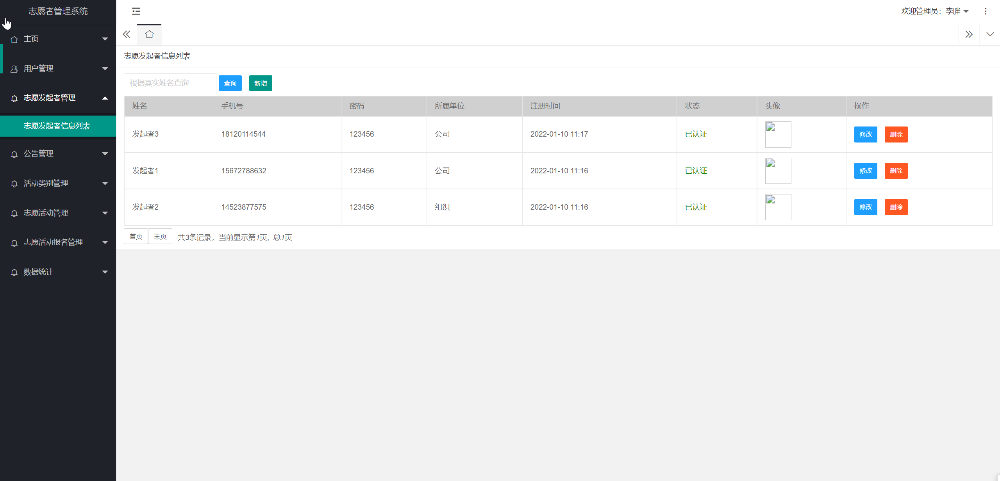
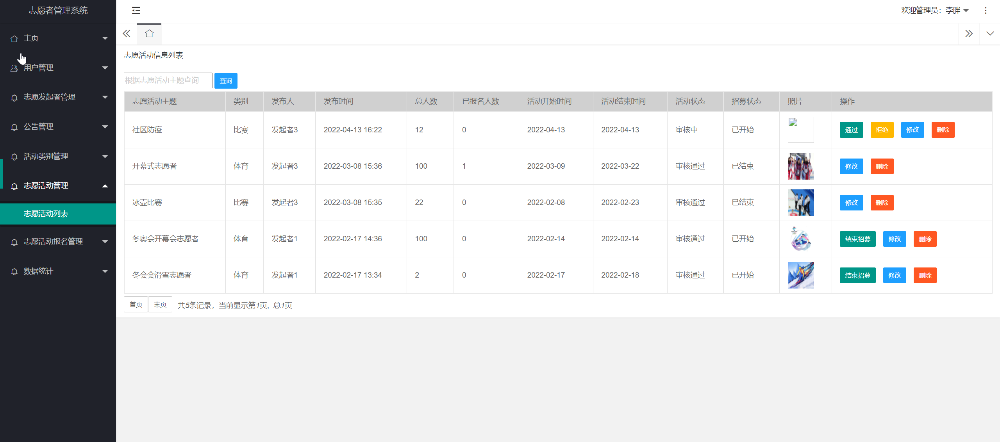

## 基于SSM框架的志愿者管理系统(程序+报告)

- <b>完整代码获取地址：从戎源码网 ([https://armycodes.com/](https://armycodes.com/))</b>
- <b>技术探讨、资料分享，请加QQ群：692619798</b> 
- <b>作者微信：19941326836  QQ：952045282</b> 
- <b>承接计算机毕业设计、Java毕业设计、Python毕业设计、深度学习、机器学习</b>
- <b>选题+开题报告+任务书+程序定制+安装调试+论文+答辩ppt 一条龙服务</b>
- <b>所有选题地址 ([https://github.com/YuLin-Coder/AllProjectCatalog](https://github.com/YuLin-Coder/AllProjectCatalog)) </b>

## 项目介绍
基于SSM框架的志愿者管理系统，项目分为游客、志愿者、志愿发起者、管理员四个角色，主要功能如下
志愿者管理系统分为前台和后台两个部分，前台主要是展示志愿活动列表、以及公告列表，管理员，其中游客有注册、登录、个人信息管理、申请志愿者等功能模块。志愿者有注册、登录、个人信息管理（查看、修改个人信息）、报名、查看我的报名信息等功能模块。志愿发起者有登录、个人信息管理、志愿活动管理、志愿活动报名管理、数据统计等功能模块。管理员有登录、个人信息管理、用户管理、志愿发起者管理、公告管理、活动类别管理、志愿活动管理、数据统计、志愿活动报名管理等功能

## 项目技术
- 编程语言：Java
- 数据库：MySQL
- 前端技术：JSP、JavaScript、Jquery、echarts
- 后端技术：Spring、SpringMVC、MyBatis

## 运行环境
- JDK版本：JDK1.8及以上
- 开发工具：IDEA、Ecplise、Myecplise都可以
- 数据库: MySQL5.7及以上

## 运行截图

